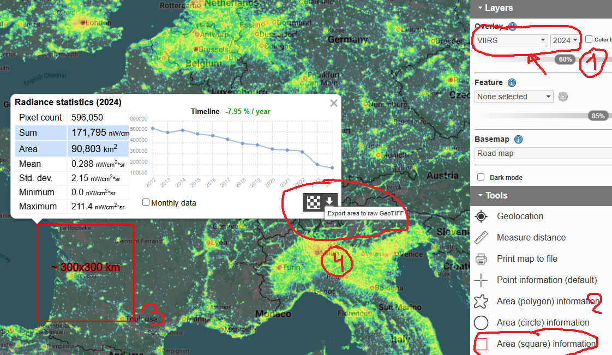
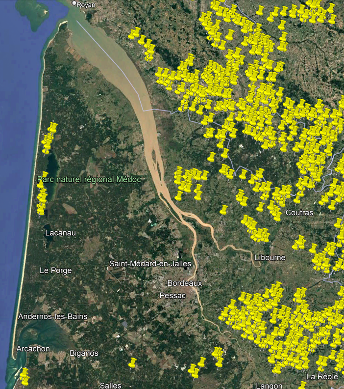

# python-auroraspot

Search for Northern Lights perfect spots

L'idée est de trouver des endroits
 - surélevés
 - avec un espace dégagé vers le nord
 - sans trop de pollution lumineuse
 - sans ville au nord
 
On pourra ajouter plus tard des filtres comme 
 - ne pas être dans une forêt
 - être proche d'une route
 - sans ligne électrique dans le champ de vision
 - ...
 
# How to generate

`launch.sh` script calls subprogram to perform treatments

Result is in `extracts` folder.

Input maps are in `data` folder, you need to extract asc files from IGN:

[BD ALTI® 25M](https://geoservices.ign.fr/bdalti) 
you need to extract asc files into `data/BDALTI_ASC` folder
you can process multiple areas at the same time

VIIRS 2024 can be retreived from following website [lightpollutionmap.info](https://www.lightpollutionmap.info/)
Follow those steps:

Save exported file to `data/viirs_2024.tif`

# Example 

