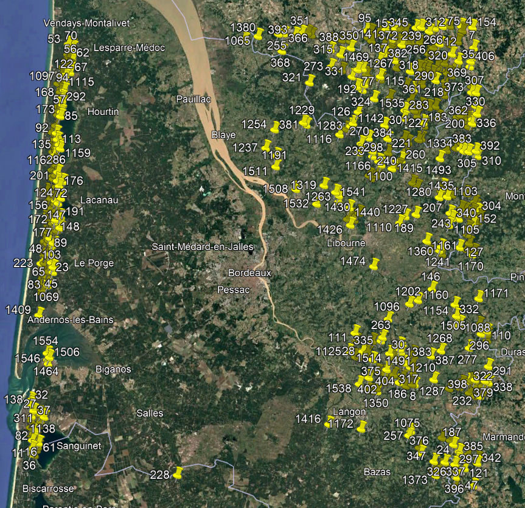
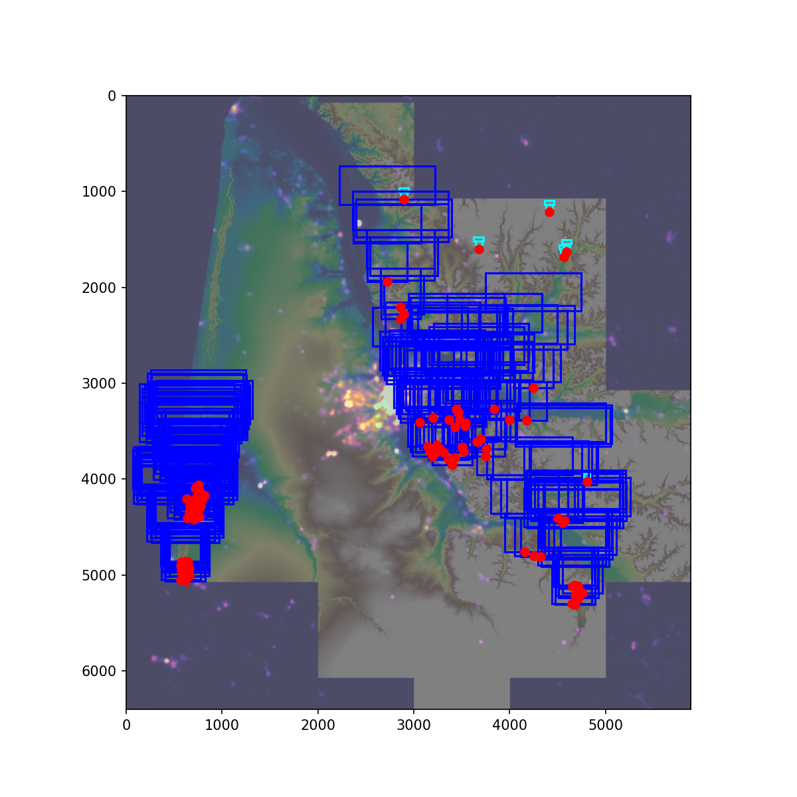

# python-auroraspot

Search for Northern Lights perfect spots

L'idée est de trouver des endroits
 - surélevés
 - avec un espace dégagé vers le nord
 - sans trop de pollution lumineuse
 - sans ville au nord
 
On pourra ajouter plus tard:
 - ne pas être dans une forêt ou au milieu d'un lac
 - être proche d'une route (accessibilité générale)
 - sans ligne électrique dans le champ de vision
   (cf https://opendata.reseaux-energies.fr/reutilisation/?id=15)
 - paramètrer l'orientation
 - utiliser des cartes plus précises (RGE Alti 1m / MNS du Ladar HD)
 - ...
 
# How to generate

`launch.sh` script calls subprogram to perform treatments

Result is in `extracts` folder.

Input maps are in `data` folder, you need to extract asc files from IGN:

[BD ALTI® 25M](https://geoservices.ign.fr/bdalti) 
you need to extract asc files into `data/BDALTI_ASC` folder
you can process multiple areas at the same time

VIIRS 2024 can be retreived from following website [lightpollutionmap.info](https://www.lightpollutionmap.info/)
Follow those steps:

Save exported file to `data/viirs_2024.tif`

# Example 

KML output can be found HERE: [spots.kml](https://raw.githubusercontent.com/nefethael/python-auroraspot/refs/heads/main/extracts/spots.kml)

# Debug

Rejected points can be seen directly in debug image

